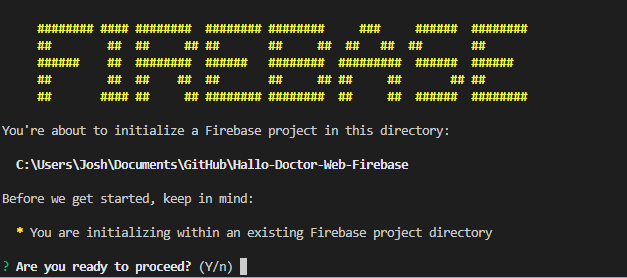
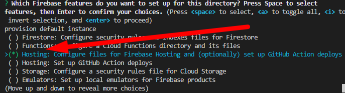
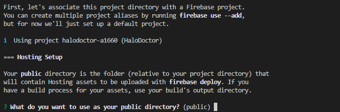
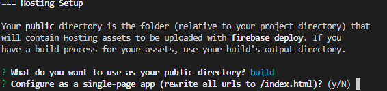
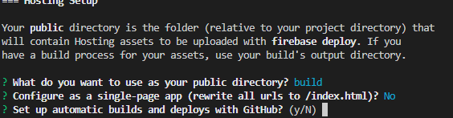

# Deploy Hallo Doctor Web

Deploy hallo doctor web app meaning, that we will make our web app live and other people will be able to access it,
here we will deploying it to Firebase Hosting, you can deploying it to your own hosting, but for simplicity we will use `Firebase Hosting` feature

### 1. Init Firebase

we need to initialize Firebase project in our web app first : 

- Open your project in `/Hallo-Doctor-Web-Firebase` in VSCode
- Open the terimanal in VSCode `Terminal -> New Terminal`
- type `firebase init` enter
- if it asking you, `you are initializing with in an existing firebase project` type **Y** and then enter

- if not, probably you are getting asked to choose your firebase project, just choose your firebase project
- after that you need to tick `Hosting: configure files for...` by pressing space, and then enter to confirm

- and then you will get asked, `what do you want to use as your public directory?` type **build** and then enter

- after that yow will get askd `Configure as a single-page app` type **N** enter

- `Setup automatic builds and deploy`, for now type **N** enter
- 

after all of that, we are successfully setup our firebase hosting initialization

### 2. Deploy our firebase app

Now to deploy our first app you just need to type in your command:

```npm
firebase deploy
```

if the deployment is success, you should get your domain url