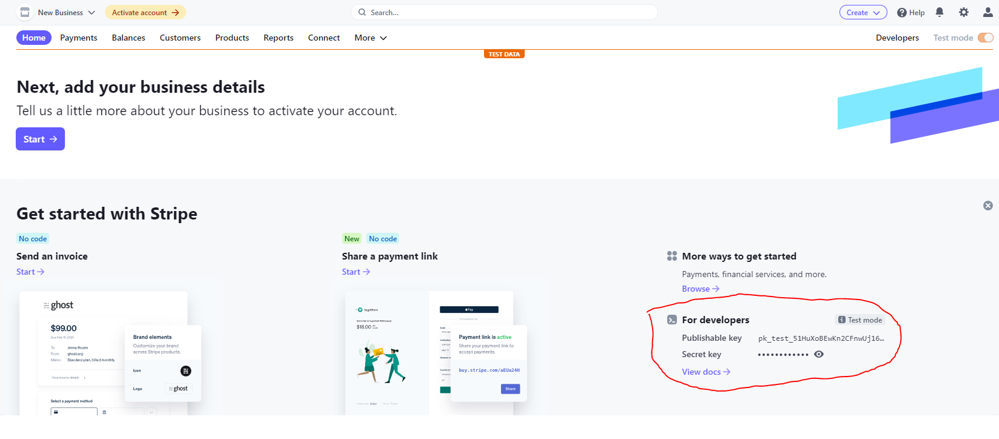

# Payment Gateway

A payment gateway is a merchant service provided by an e-commerce application service provider that authorizes credit card or direct payments processing for e-businesses,
here we will use a payment gateway to provide payment services for users, when they are about to place an order for a doctor's timeslot

## Stripe Payment Gateway

here we will use Stripe payment gateway, because Stripe is one of the largest payment gateways, and is widely used, but if you want to use another payment gateway, modifying the app will be very easy, just change `src/pages/PaymentPages.tsx`, but you will also need to modify the cloud function feature, but here we will using stripe payment gateway, to setup stripe payment gateway :

- goto Stripe official site and register new account https://stripe.com/
- when Stripe asks you to activate your account, you can **activate it later**
- for now we only need a `Publishable key` and a `Secret key` you can get it here https://dashboard.stripe.com/test/dashboard



- Copy Stripe `Publishable key` and paste it in `.env` file at the root project, if you don't have `.env` file in your project you need to create it first and copy the content from `.env_example` to your newly create `.env` file and pate that **Stripe Publishable Key** to `STRIPE_PUBLISHABLE_KEY=put_your_publishable_key_here`

your `.env` file should look like this

```jsx title="/.env"
STRIPE_PUBLISHABLE_KEY=pk_test_51HuXoBEwKn2CFnwUj16GmeFcmNGzJi2Kc7Jh2yE000sKLiReYsP2JWyW4RoUVeJnjbesipOa4GaY6PuV5rphhlIF00LiFf95
AGORA_APP_ID=
```

for the Secret Key in Stripe Dashboard, we have to add it to the Firebase Cloud Function that we previously setup in folder `/Halo_Doctor_Cloud_Function_Firebase`

:::info
Stripe Secret Key must be added to the Firebase cloud Function, for verify payment
:::

## Add Stripe Key To Firebase Cloud

Open the Firebase Cloud Function Project `/Halo_Doctor_Cloud_Function_Firebase` and create `.env` file in folder `function/`
copy the content from `.env_example` to your newly create `.env` and pate the `Stripe secret key`

```ts
AGORA_APP_ID=
AGORA_CERTIFICATE=
STRIPE_SECRET_KEY=sk_test_51HuXoBEwKn2CFnwUTqw8kKeh1Si9L0vG4zSbAbKm1OWpRfIhYLZA1R3ypELDXDCntE28PJ9Y2nw62kwsKBnu1fvq008BzHkszK
STRIPE_WEBHOOK_SECRET=
```

- now we can deploy it using this command

```
firebase deploy
```
