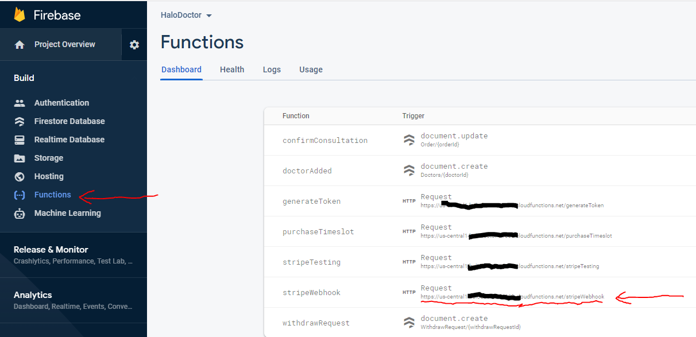
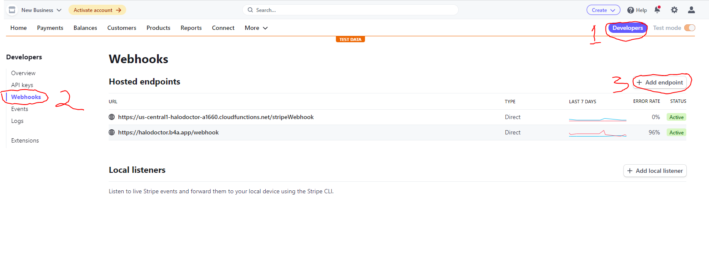
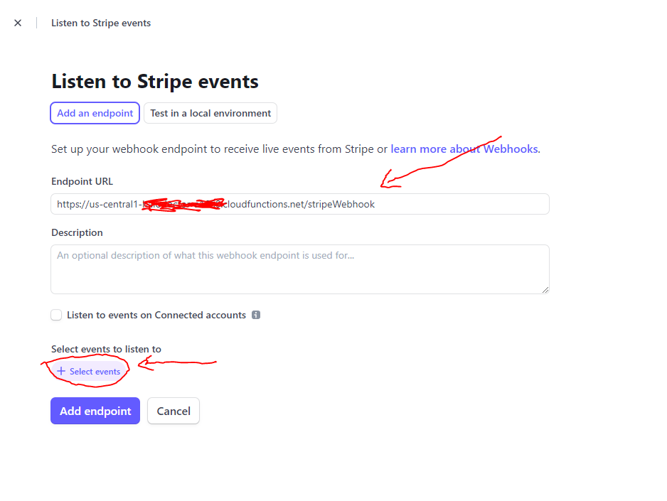
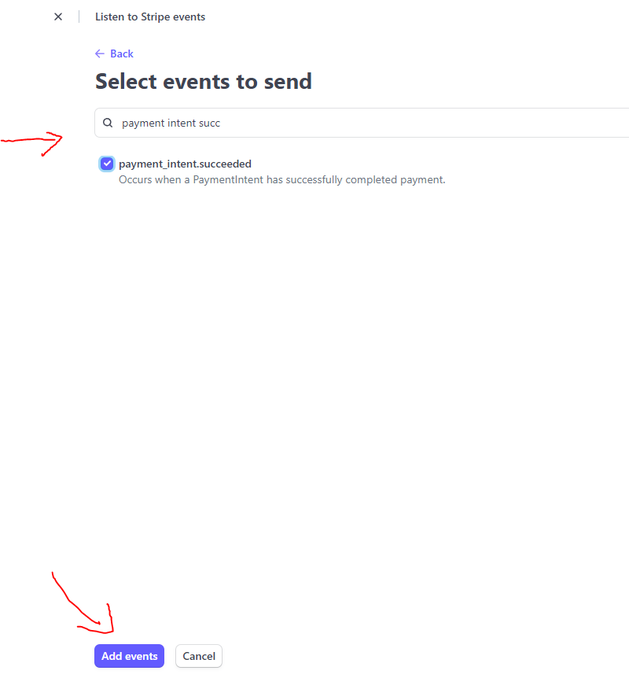
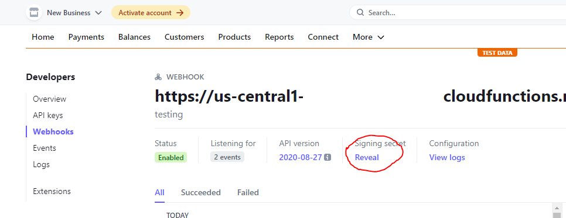

# Stripe Webhook

after we have successfully deployed our Firebase Cloud Function, then we have to set up the stripe Webhook, its function is so that we can get notifications to our firebase server when a payment has been successfully made, and we can handle it like change client order status, to `success`

to setup Stripe Webhook :

- we need stripe webhook url, open your Firebase Console -> Select your project -> `Functions`
- then copy URL from `stripeWebhook` section



- after you copy `stripeWebhook` url, goto stripe [dashboard](https://dashboard.stripe.com/)

- click `Developer` top right corner, -> click `Webhooks` -> and then click `Add Endpoint`



- paste that `stripeWebhook` url, in `Endpoint Url` sections

- and click `select event`



- search `payment intent success` -> activate it -> `Add events`

- click `Add Endpoint`



- and then copy sign in secret from that `webhook`



## Add Stripe Webhook Signin To Firebase Cloud

now, open `/Halo_Doctor_Cloud_Function_Firebase` and add that webhook key to our `.env file` your `.env` file should look like this :

```tsx
AGORA_APP_ID=
AGORA_CERTIFICATE=
STRIPE_SECRET_KEY=sk_test_51HuXoBEwKn2CFnwUTqw8kKeh1Si9L0vG4zSbAbKm1OWpRfIhYLZA1R3ypELDXDCntE28PJ9Y2nw62kwsKBnu1fvq008BzHkszK
STRIPE_WEBHOOK_SECRET=whsec_SDpGndH6NGkYYmYeKA9LJorSubB2wwb4
```
- now we can deploy it using this command

```
firebase deploy
```

- OK, the application is now able to accept webhooks from stripe, and confirm payments

Next we have to setup a video call with agora.io
