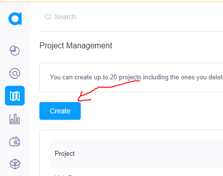
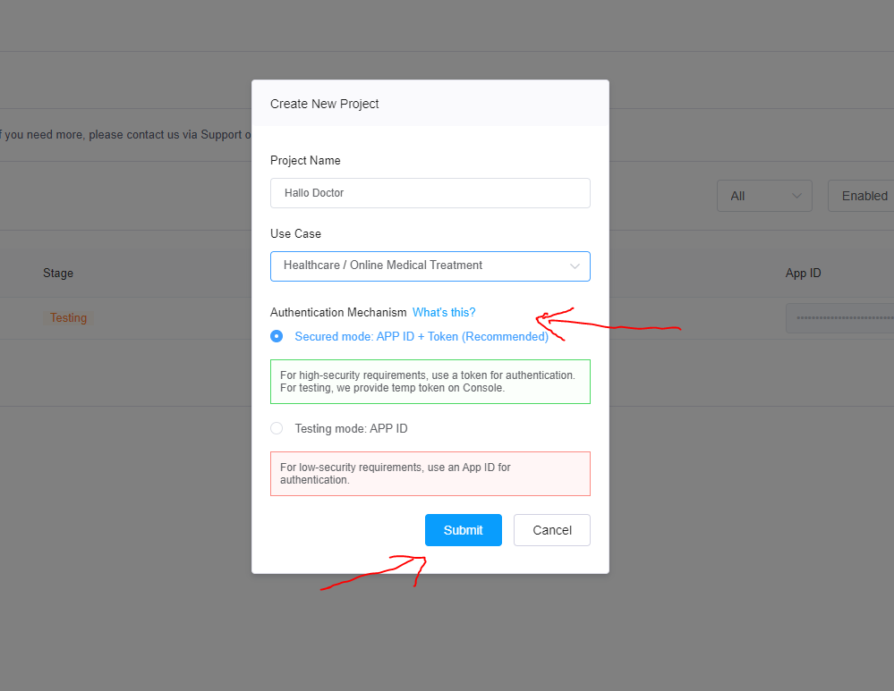
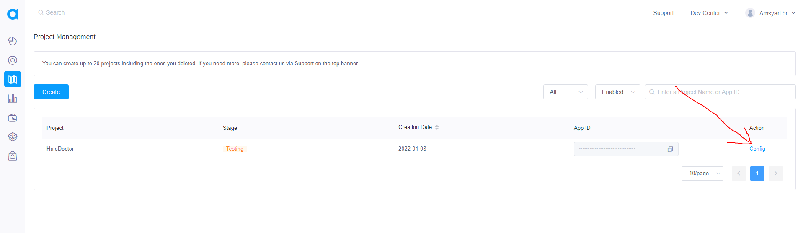

# Agora.io for Video Call

agora provides a library to make video calls, with a very easy setup, this project uses agora.io to make video calls between doctors and clients, in order to make our video calls working wll we need `App id` in agora, and `App Certificate` to get that

- First register new account at <https://www.agora.io/>
- after registering a new account, goto Agora Console [Agora Console](https://console.agora.io/)
- create new Project



- add the app name and select `Secure Mode App Id + Token` and -> `Submit`



- next we have to take the `App Id` and `App Certificate` from the agora project that we just created, we click `config`



- Copy `App id`  `/Hallo-Doctor-Web-Firebase` .env file

```tsx title="/Hallo-Doctor-Web-Firebase/.env"
STRIPE_PUBLISHABLE_KEY=pk_test_51HuXoBEwKn2CFnwUj16GmeFcmNGzJi2Kc7Jh2yE000sKLiReYsP2JWyW4RoUVeJnjbesipOa4GaY6PuV5rphhlIF00LiFf95
AGORA_APP_ID=5918380664394b78bd3b16842b254f3
```

- and Copy`App Id` and also `App Certificate` to `/Halo_Doctor_Cloud_Function_Firebase` .env file

```tsx title="/Halo_Doctor_Cloud_Function_Firebase/functions/.env"
AGORA_APP_ID=5918380664394b78bd3b16842b254f3c
AGORA_CERTIFICATE=ebecd53a7f384d4c84c4a78babcca4bd
STRIPE_SECRET_KEY=sk_test_51HuXoBEwKn2CFnwUTqw8kKeh1Si9L0vG4zSbAbKm1OWpRfIhYLZA1R3ypELDXDCntE28PJ9Y2nw62kwsKBnu1fvq008BzHkszK
STRIPE_WEBHOOK_SECRET=whsec_SDpGndH6NGkYYmYeKA9LJorSubB2wwb4
```

- after all of that, run the below command to deploy your firebase cloud

```cmd
firebase deploy
```

after the cloud function is successfully deploye, your video call should be work, next we will setup the `Doctor Category` and `Admin Dashboard`
