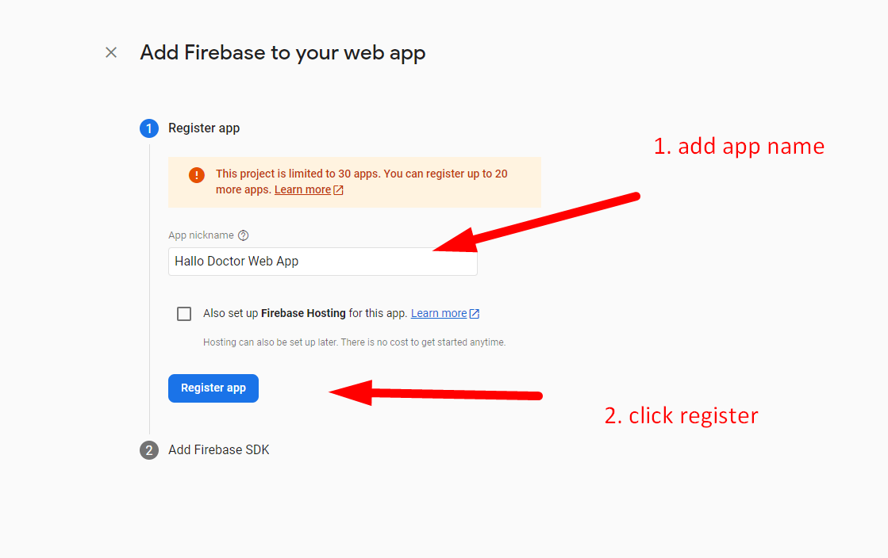

# Create Web App Firebase

After we create our Firebase project, inside that project we can create several app, if you bought [Hallo Doctor Flutter](https://codecanyon.net/item/halo-doctor-video-call-doctor-booking-appointment-timeslot/35457683) android and ios version, you can also add Android & Ios version in the same project and interaction with each other, but in this tutorial we will only create one app which is `Hallo Doctor Web App` :

- inside your firebase project click `</>` icon to add web app

- after that, add your app name, here i named it Hallo Doctor Web, to differentiate it with other app, like android and ios app

- click Register

After that you will get your app credential, save that `firebaseConfig` because later we will put that inside our React JS `Hallo Doctor Web` App

- and click Next

:::info
make sure you remember to save that firebaseConfig
:::

continue to the next page
