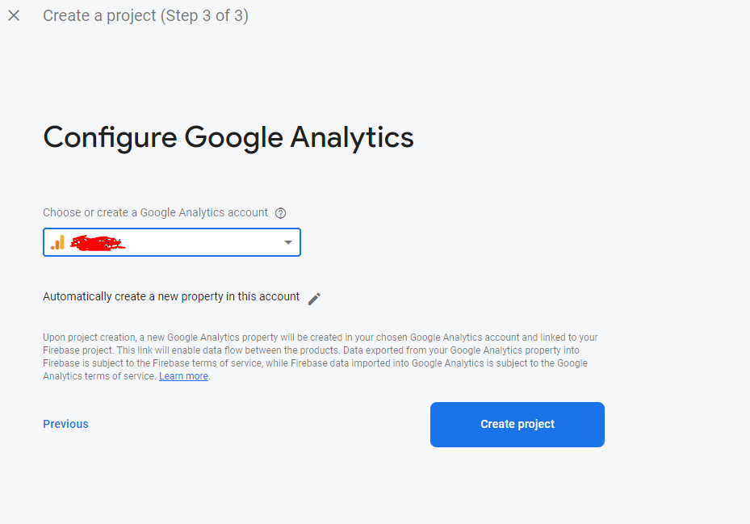

# Setup Firebase

Before we can run our project, first we will need to prepare our hosting which is Firebase, `Hallo Doctor Web App` can be hosted on any React JS hosting services, but we still need firebase for our authentication, cloud function, and other firebase cloud feature, so you can hosted the web on other service like Netlify or your own server, and still use firebase for other feature but for simplicity in this tutorial we will fully use `Firebase` as our backend, don't worry for starting `Firebase is free`, you can check the firebase pricing [here](https://firebase.google.com/pricing)

:::info
it's mandatory to enable `Blaze Plan` on your firebase project, otherwise we probably cannot deploy our cloud function
:::

### Register Firebase & Create Project

- Register free account at <https://console.firebase.google.com/>

- after register, click `Add Project` at (https://console.firebase.google.com/)

- after that enter your `app name` it can be up to you, here I enter the name "Helo Doctor"

- and then click Continue

- Then you will be asked to choose your Google Analytics account
- choose your account and click Create Account

- done, you have successfully created a firebase project, then in this project we will create a firebase app, which is our `Hallo Doctor Web` app
