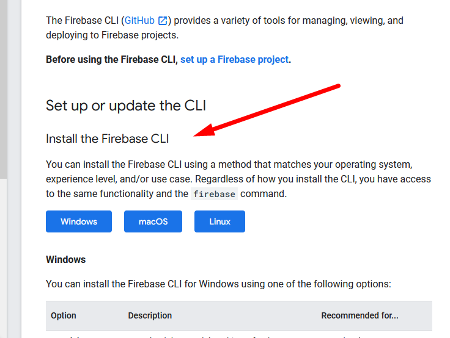

# Setup Environment

Before we can run our `Hallo Doctor Web`, we need to prepare our Computer to be able to run it locally,
 and then later we will publish it to Firebase Hosting, but before that we will need to install few App in our Computer :

## Application Requirement

in order to run `Hallo Doctor Web` you need to install few application which is : 

- Node Js
- Yarn
- Firebase CLI

### Installing Node JS

in this `Hallo Doctor Web` v1.1.1 we use Node Js `v18.14.0`
to install it go to this website https://nodejs.org/en/download/ and 
and choose base on your operating system
for detail tutorial you can follow this tutorial for windows <https://www.geeksforgeeks.org/installation-of-node-js-on-windows/>

### Installing Yarn

we are not using npm to run our project, but we use `Yarn`, you need to install yarn on your system

- install yarn <https://classic.yarnpkg.com/lang/en/docs/install/>
  

### Installing Firebase CLI

We will need Firebase cli to easity deploy our `Hallo Doctor Web` to Firebase Hosting, and we need to install it on our computer : 

- install Firebase CLI <https://firebase.google.com/docs/cli>
- bellow choose your operating system, you don't have to follow that firebase cli documentation, you just need to install it on your computer

If all of that Software succefully installed on your computer, you are now ready to run `Hallo Doctor Web` on your computer, and deploy it later, continue to the next tutorial
