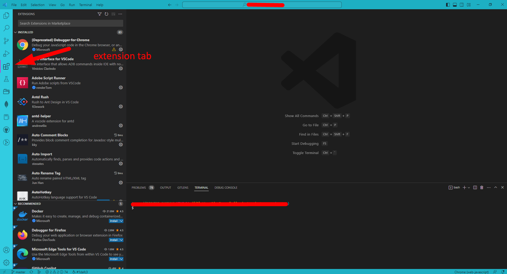

# Setup Tool

## Tools We Use

We will need some tool to edit our `Hallo Doctor Web` App, in this tutorial we will use `Visual Studio Code` you can use other text editor but we recommend you to use Visual Studio Code, and also we will need browser
we recommend using `Google Chrome` or `Mozilla Firefox` to preview our Web App

- [Download Visual Studio Code](https://code.visualstudio.com/download)
- Browser [Google Chrome](https://www.google.co.id/chrome/?brand=JJTC&gclid=Cj0KCQiAgaGgBhC8ARIsAAAyLfE3Uk7Li9SkAo6m7ZJoLy5JsUWMNVb8ox60FYhTgg6Fn4WAZ5yvbGoaAh68EALw_wcB&gclsrc=aw.ds) or [Mozilla Firefox](https://www.mozilla.org/id/firefox/new/)

## Visual Studio Code Extension

Visual studio extension, will help us to change, preview our app more easily,
you don't have to get this extension, but we recomend you to install it on your `Visual Studio Code`, to install Extension open your Visual Studio Code -> goto Extension

these are our VSCode Extension recomendation, you can just search the name in extension tab :

- JavaScript and TypeScript Nightly
- Simple React Snippets
- Prettier - Code formatter
- Firebase
- Tailwind CSS IntelliSense
- Peacock (this one for changing the vs code color, to make it easy differentiate the project you working on, make you not confuse )
