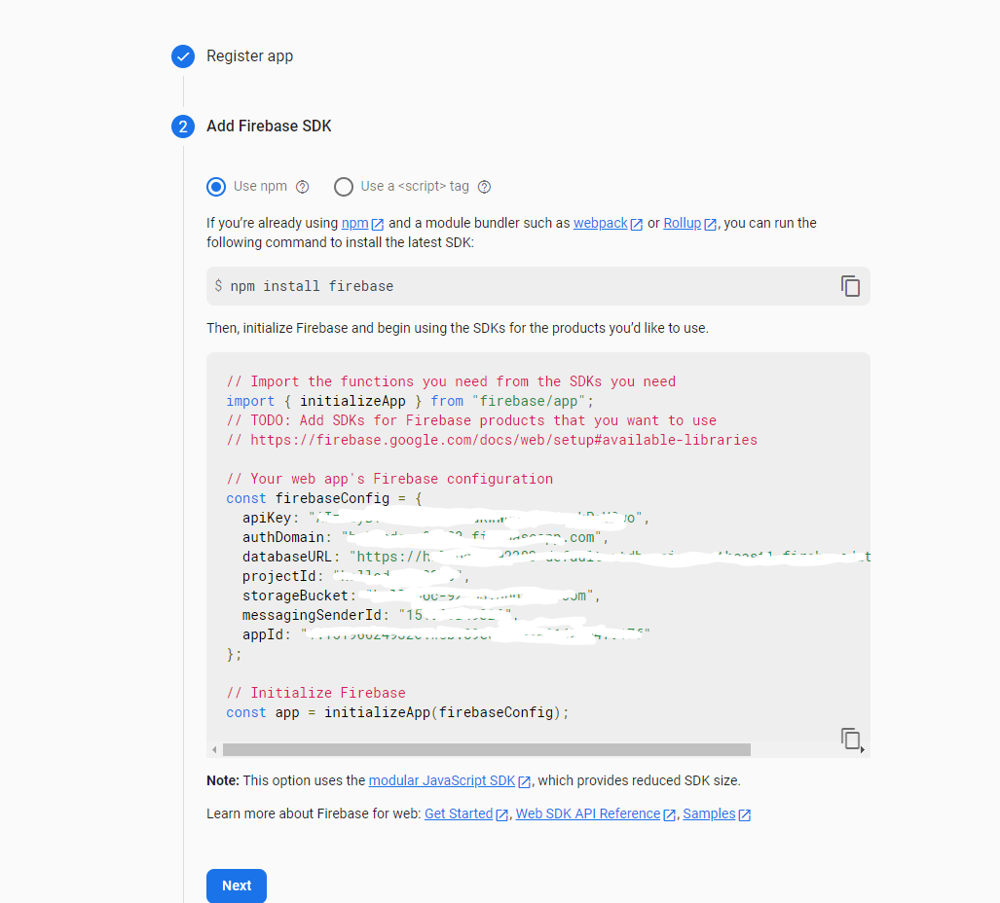
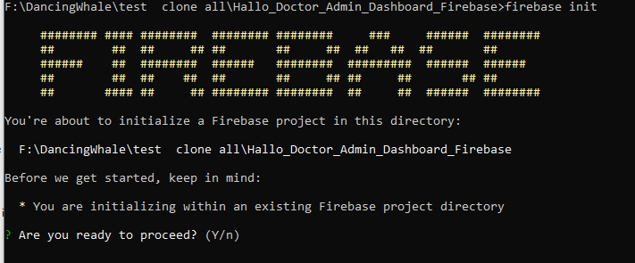

# Setup Web Admin Dashboard

The web admin in this project is using `React`, not using flutter web because of performance issues, it's better to use mature technology in web development to get applications that have good performance, setting up web admin is very easy

- open folder `/Hallo_Doctor_Admin_Dashboard_Firebase` and install all dependencies
```
npm install --legacy-peer-deps
```
:::info
if you getting error, try to use [yarn](<https://classic.yarnpkg.com/lang/en/docs/install/#windows-stable>) instead of npm
:::
- while the project installs all the dependencies, we have to create a new web app in our firebase project


- enter your web admin nickname

- and click register app


- next you will get the credentials for your web admin app



- open Firebase configuration in your web admin project `/Hallo_Doctor_Admin_Dashboard_Firebase/src/configs/FirebaseConfig.js`

- fill in all the fields according to credential you got from firebase

- and if all the dependencies installation has been completed, and the firebase config is setup then we will build the react app

### Build Web Admin Dahsboard

```
npm run build
```

- After the app is built, we have to initiate firebase hosting in this project, run :

```
firebase init
```



- just enter

- then you will be asked to choose what firebase features will be activated in this folder, choose `Hosting: Configure File for Hosting`


- and you will be asked to choose your firebase project, choose the project that you setup previously


- then you will be asked to enter the name of your public directory folder, enter `build` because the build folder is the default build folder of this react project, but make sure you've already built the react app


after everything is done, your firebase has been initiated, then we will deploy it

```
firebase deploy
```

after deploying it, you will get your web admin url and you can login to your web admin dashboard, please login using the email and password that we have setup in the `setup doctor category and admin credential` section
