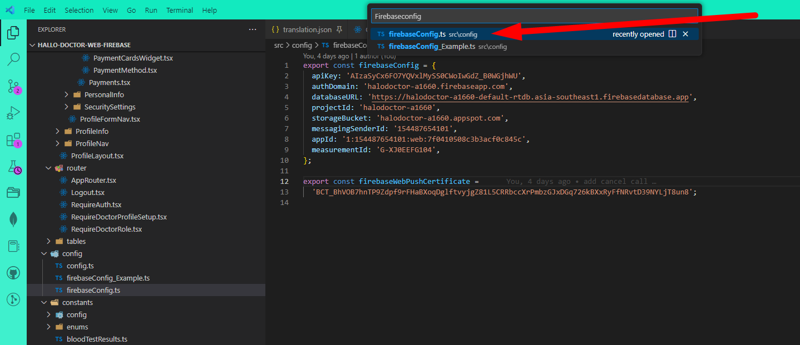

# Setup Hallo Doctor Web ReactJS

Once your purchase `Hallo Doctor Web` app, you will get three source code :

- `/Hallo-Doctor-Web-Firebase`
- `/Halo_Doctor_Cloud_Function_Firebase`
- `/Hallo_Doctor_Admin_Dashboard_Firebase`

First one is the HalloDoctor Web App build with react JS, Typescript, and Antd UI, the second one is for cloud function
that in the previous step we already setup, and then the third one is for admin dashboard that we will setup to

So now we will setup the `/Hallo-Doctor-Web-Firebase` to be able to run it locally, and run it correctly, follow this step :

### 1. Open the Project in VSCode

The first thing we need to do after we setup our Firebase is to open `/Hallo-Doctor-Web-Firebase`, in Visual Studio Code

to open a project in Visual Studio Code, it's very easy

- Open Visual Studio Code -> Click File -> Open Folder -> chose `/Hallo-Doctor-Web-Firebase` folder

or

- Open CMD if you use windows
- Go to `/Hallo-Doctor-Web-Firebase` directory
- and type `code .`


### 2. Install All Dependency

after opening our project in VSCode, we need to install all the dependency, we are not goin to use NPM
we are using `Yarn`, make sure you already installing `Yarn`,

- in VScode project, open the `Terminal`->`New Terimanal`
- type `yarn install` and enter to install all the dependency

### 3. Add Firebase Config

after installing all the dependency, we need to add our Firebase Config, that we alredy get when creating a web app in Firebase Project

- open `FirebaseConfig.ts` file `CTRL+P` search for the `FirebaseConfig.ts` file, or you can find it in `src/config/FirebaseConfig.ts`



- and paste your firebaseConfig file, that we get before, when creating web app in Firebase Project
  
:::info
if you forgot the firebase config, you can go to project setting, by clicking gear icon :gear: -> Project setting -> General -> Scroll down> choose your app
and there you can get your firebase config, if you dont have the project probably you are skipping this tutorial, go to create new app in previous tutorial
:::


### 4. Run the Project

You can now run the the app by typing :

```tsx
yarn start
```

if it run successfully without error, you can now open your browser, and goto `http://localhost:3000`


but we are not done yet, we still need to setup the `Stripe Payment Gateway` and `Agora Video Call`, continue the tutorial
